#

## 1. 网页抓取

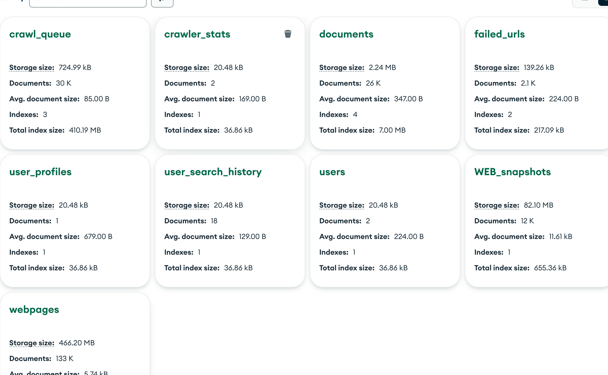
webpages 集合抓取了 13.3 万的数量。

## 2 文本索引

使用 elasticsearch 的服务。

### 2.1 对抓取的网页索引

```python
index_name = "webpages_index"
mapping = {
"mappings": {
   "properties": {
      "title": {"type": "text", "analyzer": "ik_max_word"},
      "main_content": {"type": "text", "analyzer": "ik_max_word"},
      "url": {"type": "keyword"},
      "crawled_at": {"type": "date"}
   }
}
}
```

### 2.2 对抓取的文档进行索引

```python

document_index = "documents_index"
mapping = {
   "mappings": {
      "properties": {
            "filename": {
               "type": "text",
               "analyzer": "ik_max_word"  # 支持中文文件名分词
            },
            "file_type": {"type": "keyword"},
            "url": {"type": "keyword"},
            "source_page": {"type": "keyword"},
            "crawled_at": {"type": "date"}
      }
   }
}


```

### 2.3 对保存的网络快照进行索引

```py
 mapping = {
     "mappings": {
         "properties": {
             "url": {"type": "keyword"},
             "content_hash": {"type": "keyword"},
             "snapshot_date": {"type": "date"},
             "content_text": {"type": "text", "analyzer": "ik_max_word"},
             "raw_html": {"type": "text", "index": False},
             "status_code": {"type": "integer"},
             "response_headers": {"type": "object", "enabled": False}
         }
     }
 }

```

## 3 查询服务

基于向量空间模型，结合链接分析结果对查询结果进行排序。为用户提供站内查询、文档查询、短语查询、通配查询、查询日志、网页快照等共计六种高级搜索功能。

### 3.1 站内查询

基本的查询操作。

```python
   @app.post("/search")
   async def search_articles(req: SearchRequest):
      try:
         # 构建ES查询
         search_body = {
               "query": {
                  "multi_match": {
                     "query": req.query,
                     "fields": ["title^3", "content"],  # 搜索标题和内容，标题权重更高
                     "type": "best_fields"
                  }
               },
               "highlight": {
                  "pre_tags": ["<em class='highlight'>"],  # 高亮前缀
                  "post_tags": ["</em>"],                 # 高亮后缀
                  "fields": {
                     "title": {},  # 高亮标题
                     "content": {}  # 高亮内容
                  }
               },
               "from": (req.page - 1) * req.size,  # 分页起始位置
               "size": req.size  # 每页大小
         }

         # 添加排序
         if req.sort:
               search_body["sort"] = [
                  {field: order}
                  for part in req.sort.split(",")
                  for field, order in [part.split(":")]
               ]

         # 执行搜索
         result = es.search(
               index=settings.ES_INDEX,  # Elasticsearch 索引
               body=search_body          # 查询条件
         )

         # 格式化结果
         return {
               "total": result["hits"]["total"]["value"],  # 总匹配数
               "items": [
                  {
                     "id": hit["_id"],  # 文档 ID
                     "score": hit["_score"],  # 匹配得分
                     "title": hit["highlight"].get("title", [hit["_source"]["title"]])[0],  # 高亮标题
                     "content": hit["highlight"].get("content", [hit["_source"]["content"]])[0],  # 高亮内容
                     "url": hit["_source"]["url"],  # 原始 URL
                     "publish_date": hit["_source"].get("publish_date")  # 发布时间
                  }
                  for hit in result["hits"]["hits"]
               ]
         }
      except Exception as e:
         raise HTTPException(
               status_code=500,
               detail=f"搜索失败: {str(e)}"
         )

```

查询截图
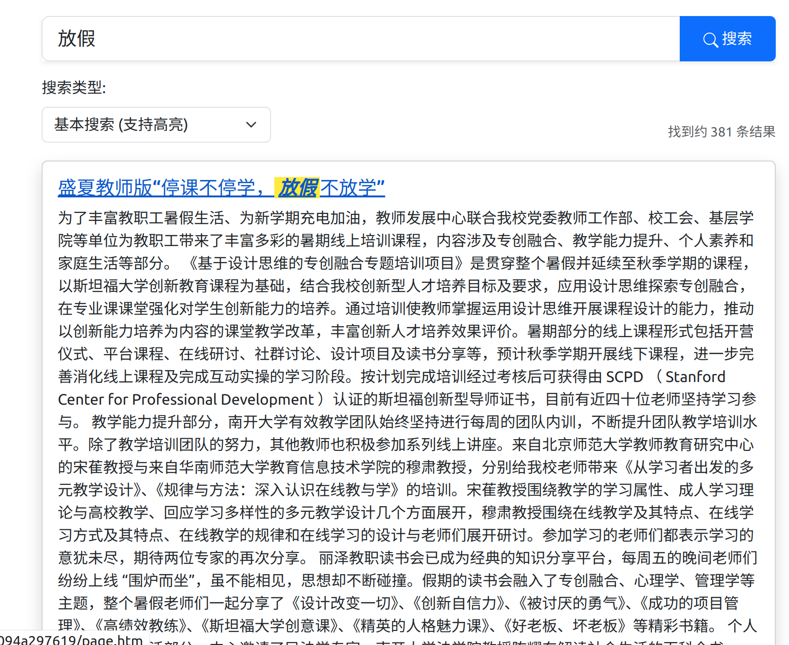

### 3.2 文档查询

一些网页可能会携带或其本身就是附件下载链接，支持对文档（doc/docx，pdf，xls/xlsx 等）的查询操作。
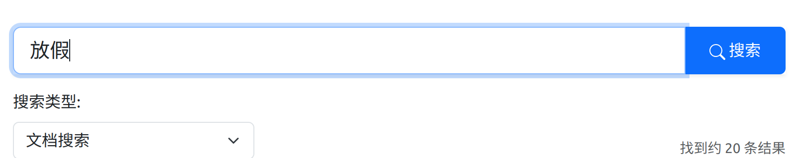
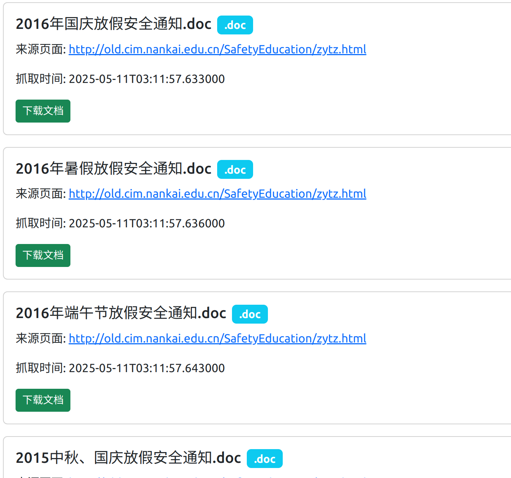

### 3.3 短语查询

也是基本的查询操作，支持对多个 Term 的查询。

- match_phrase：

  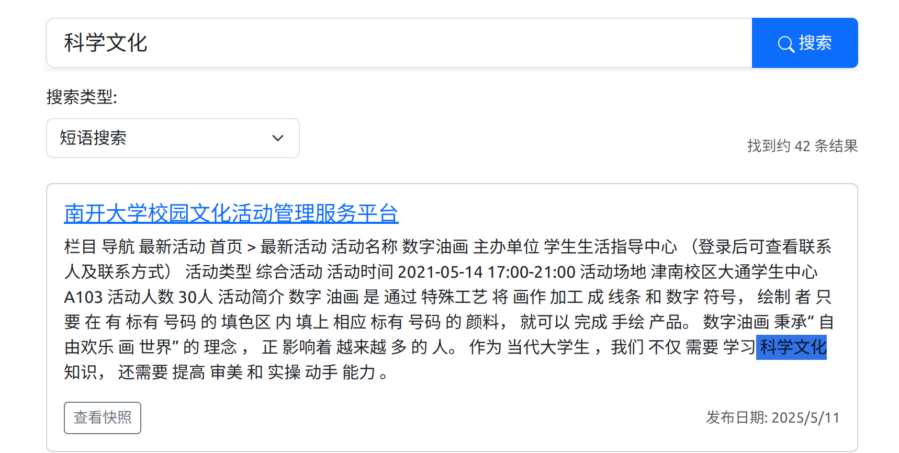
  查询科学文化
  和科学 文化
  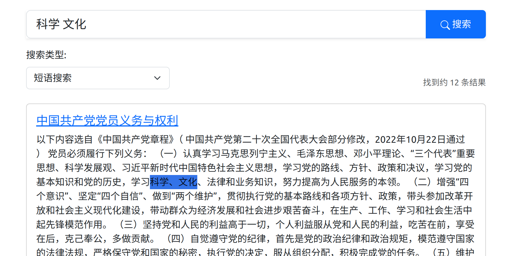

  通过 Elasticsearch 的 multi\*match 查询，类型设置为 phrase，实现了在多个字段中搜索精确的短语匹配。用户提供的短语会被分析器处理成词条序列，并在指定的字段中按顺序匹配。分页参数控制返回的结果数量和偏移，最终将匹配的文档信息返回给客户端

### 3.4 通配查询

- 通配符查询（wildcard）：输入带有 \_（多字符）和 ？（单字符）的查询，验证能否正确返回匹配内容。
  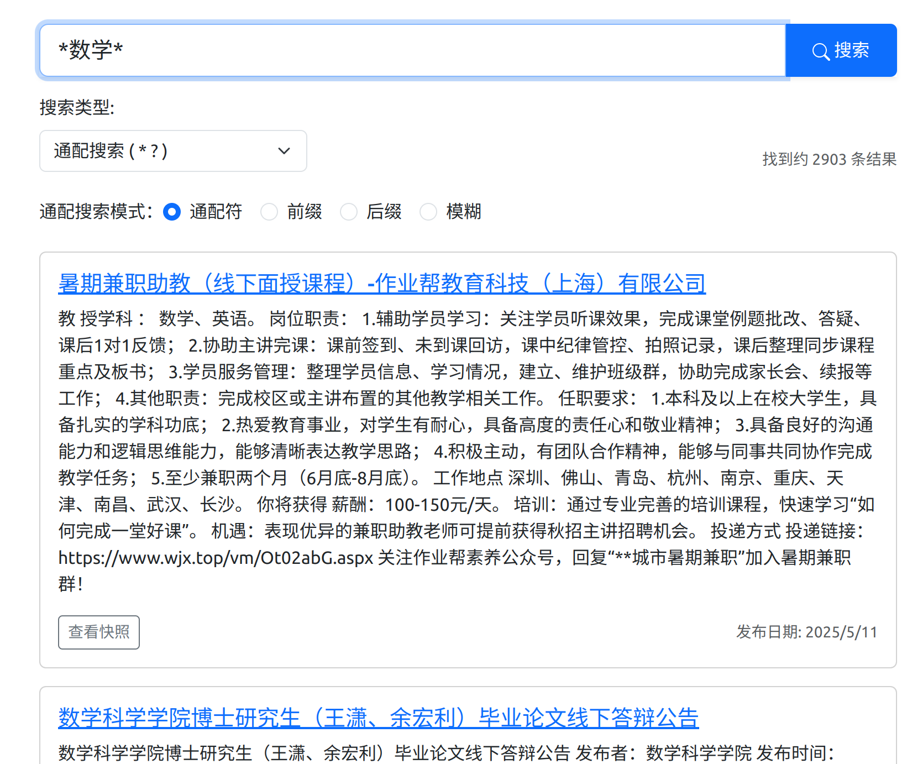
  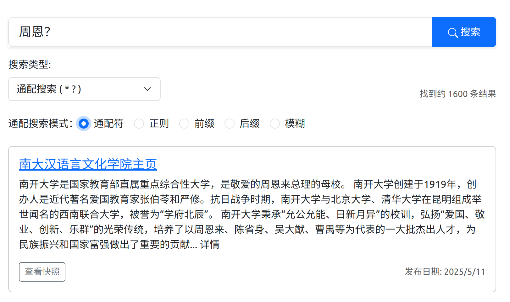
- 前缀查询（prefix）：输入前缀，验证能否返回以该前缀开头的内容。
  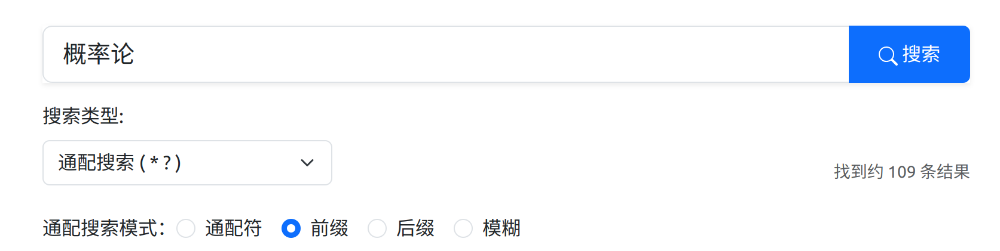
  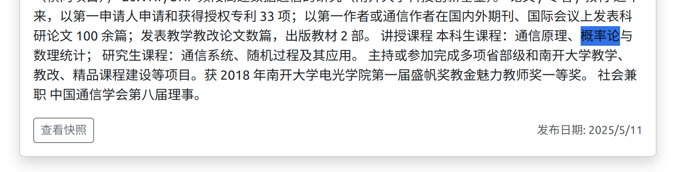
- 后缀查询（suffix）：输入后缀，验证能否返回以该后缀结尾的内容。
  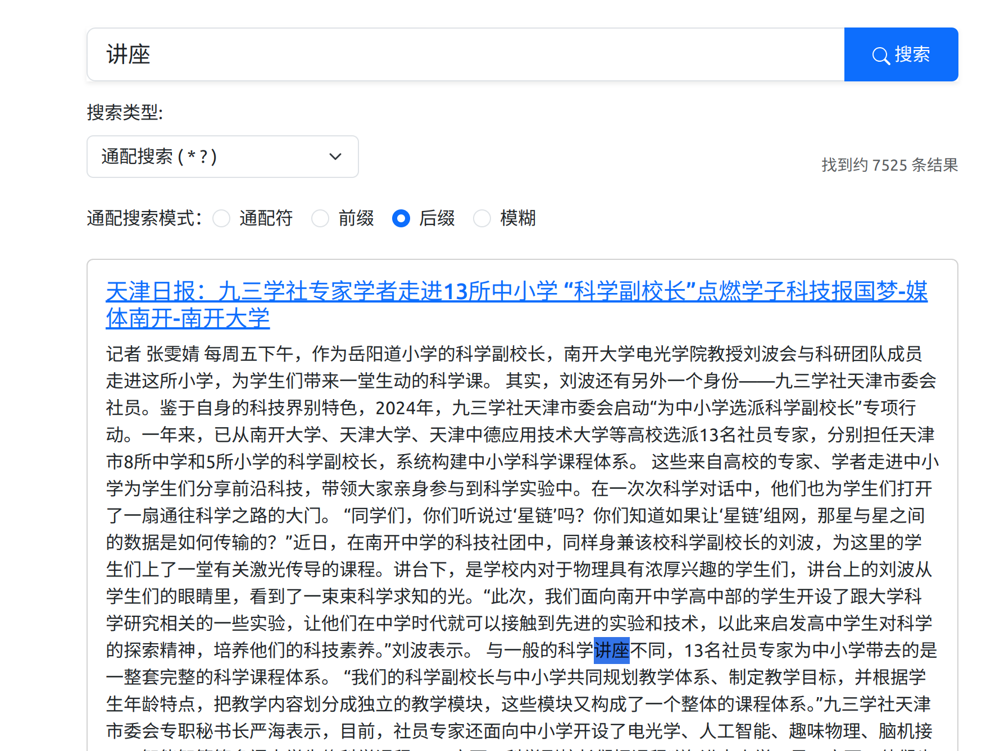
- 模糊查询（fuzzy）：输入拼写有误的词，验证能否返回正确的近似匹配内容。
  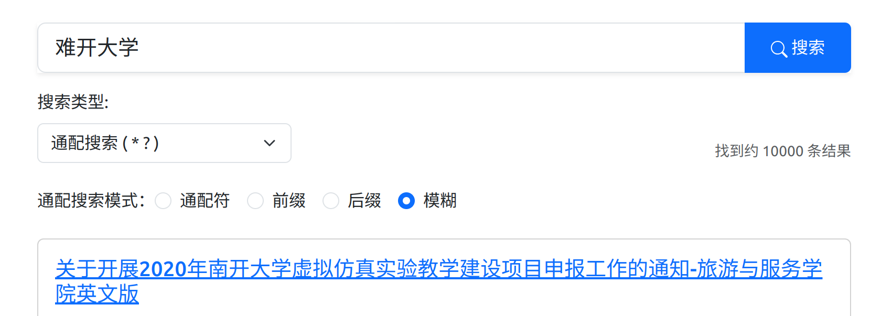

### 3.5 查询日志

状态框里实现

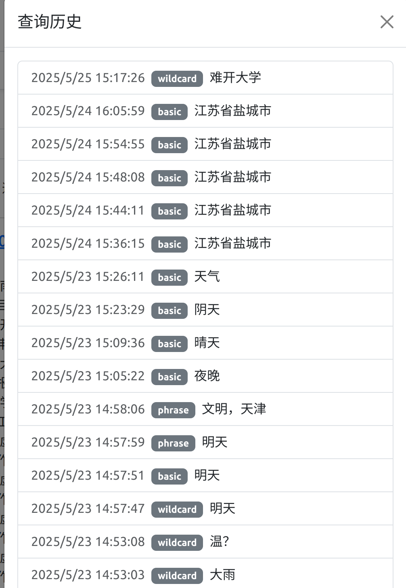

### 3.6 网页快照

1. 爬虫抓取网页时保存快照到 web_snapshots。
   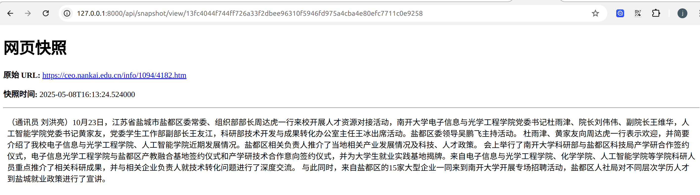

2. 用户点击“查看快照”时，访问 /api/snapshot/view/<content_hash>。
3. Flask 查询快照并渲染 snapshot.html，展示网页内容。

## 4 个性化查询

针对不同登录用户提供不同的内容排序。
建议实现一个注册/登录系统，通过提供不同的用户信息实现内容排序算法的修正。

用户登录后，后端根据其 profile（如兴趣、学院、角色等）调整 ES 查询的排序规则（如加权、boost、排序字段等）。

### 4.1 用户表结构

    用户名（唯一）
    密码（加密存储）
    其他信息（如邮箱

- 后端：

  - 用户模型：

    ```py
             from flask_login import UserMixin
    from werkzeug.security import generate_password_hash, check_password_hash
    from pymongo import MongoClient

    client = MongoClient("mongodb://localhost:27017")
    db = client["nankai_crawler_db"]
    users_collection = db["users"]

    class User(UserMixin):
        def __init__(self, username, password_hash):
            self.id = username
            self.password_hash = password_hash

        @staticmethod
        def get(username):
            user_doc = users_collection.find_one({"username": username})
            if user_doc:
                return User(user_doc["username"], user_doc["password_hash"])
            return None

        def check_password(self, password):
            return check_password_hash(self.password_hash, password)

    ```

    - 登陆相关蓝图

    ```py
             from flask import Blueprint, request, jsonify
    from flask_login import login_user, logout_user, login_required, current_user
    from werkzeug.security import generate_password_hash
    from ..models.user import User, users_collection

    auth_bp = Blueprint("auth", __name__)

    @auth_bp.route("/register", methods=["POST"])
    def register():
        data = request.get_json()
        username = data["username"]
        password = data["password"]
        if users_collection.find_one({"username": username}):
            return jsonify({"error": "用户名已存在"}), 400
        password_hash = generate_password_hash(password)
        users_collection.insert_one({"username": username, "password_hash": password_hash})
        return jsonify({"msg": "注册成功"})

    @auth_bp.route("/login", methods=["POST"])
    def login():
        data = request.get_json()
        username = data["username"]
        password = data["password"]
        user = User.get(username)
        if user and user.check_password(password):
            login_user(user)
            return jsonify({"msg": "登录成功", "username": username})
        return jsonify({"error": "用户名或密码错误"}), 401

    @auth_bp.route("/logout", methods=["POST"])
    @login_required
    def logout():
        logout_user()
        return jsonify({"msg": "已退出登录"})

    @auth_bp.route("/whoami", methods=["GET"])
    def whoami():
        if current_user.is_authenticated:
            return jsonify({"username": current_user.id})
        else:
            return jsonify({"username": None})


    ```

    - 主程序注册

    ```py
          from flask_login import LoginManager
    from .routers.auth import auth_bp

    login_manager = LoginManager()
    login_manager.init_app(app)

    from .models.user import User

    @login_manager.user_loader
    def load_user(username):
        return User.get(username)

    app.register_blueprint(auth_bp, url_prefix="/api/auth")


    ```

### 实现

1. 用户 1 登录，在个人信息里设置兴趣标签为“数学、人工智能”。
2. 用户 2 登录，在个人信息里设置兴趣标签为“讲座、心理”。
3. 两个用户分别用同样的关键词“通知”进行搜索。
4. 对比两位用户的搜索结果，应该发现：
   - 用户 1 的结果中，“数学”或“人工智能”相关内容排序更靠前。
   - 用户 2 的结果中，“讲座”或“心理”相关内容排序更靠前。
     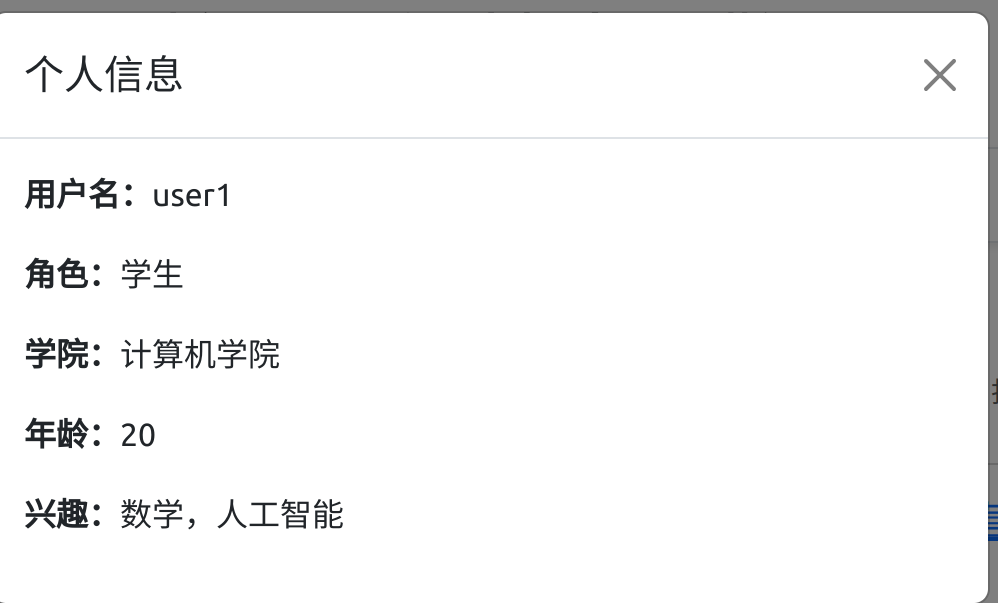
     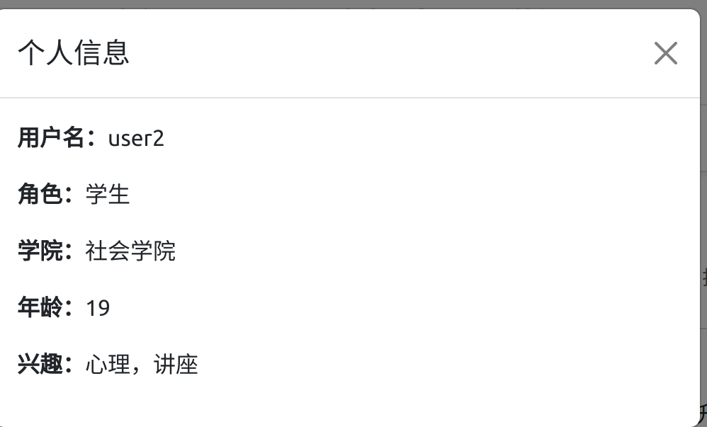
     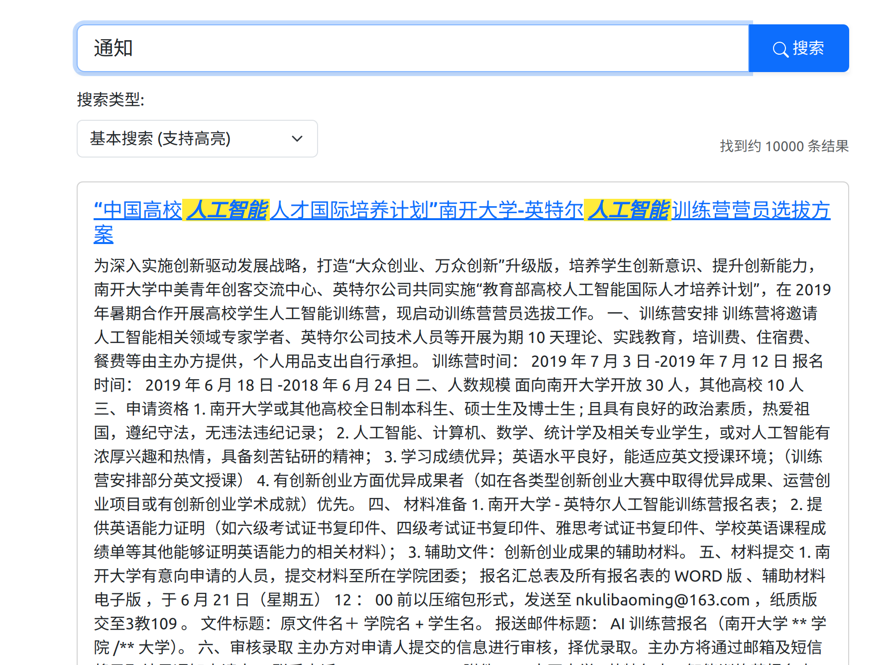
     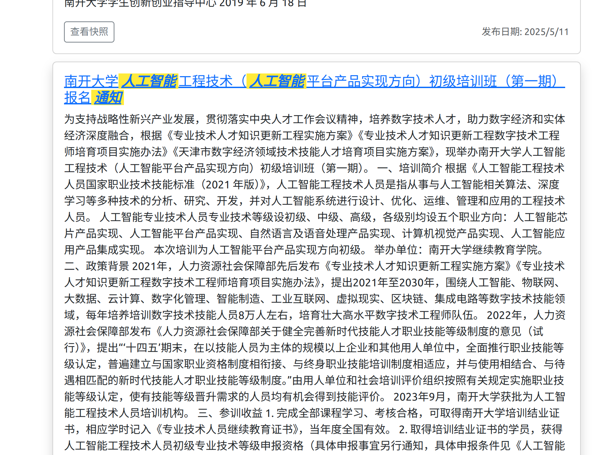
     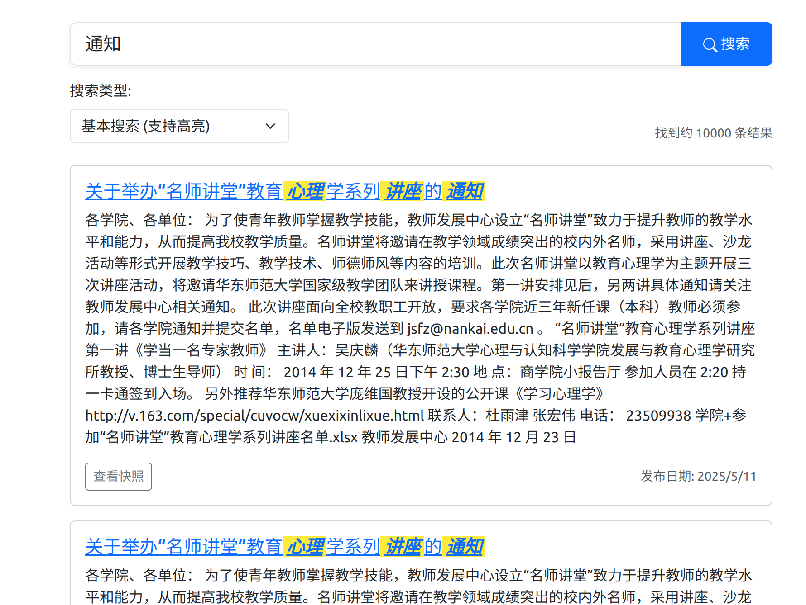

### 5 Web 界面

如图

### 6 个性化推荐

个性化推荐存在两类，一个是搜索上的联想关联，一个是内容分析后的推荐。任选其中一种实现即可。
这里选择搜索上的联想关联，

1. 修改索引 Mapping
   在 indexer.py 中，为需要联想的字段（如 title 或 main_content）增加一个 completion 类型的子字段：

```py
mapping = {
  "mappings": {
    "properties": {
      "title": {
        "type": "text",
        "analyzer": "ik_max_word",
        "fields": {
          "suggest": {
            "type": "completion",
            "analyzer": "simple"
          }
        }
      },
      "main_content": {
        "type": "text",
        "analyzer": "ik_max_word",
        "fields": {
          "suggest": {
            "type": "completion",
            "analyzer": "simple"
          }
        }
      },
      "url": {"type": "keyword"},
      "crawled_at": {"type": "date"},
      "content_hash": {"type": "keyword"}
    }
  }
}


```

2. 修改数据导入逻辑
   在 generate_data 函数中，为每个文档的 title 和 main_content 字段增加 suggest 子字段：

```py
def generate_data():
    for doc in collection.find():
        yield {
            "_index": index_name,
            "_id": doc["url"],
            "_source": {
                "title": doc.get("title"),
                "title.suggest": doc.get("title"),  # 用于联想
                "main_content": doc.get("main_content"),
                "main_content.suggest": doc.get("main_content"),  # 用于联想
                "url": doc.get("url"),
                "crawled_at": doc.get("crawled_at"),
                "content_hash": doc.get("content_hash")
            }
        }


```

3. 实现联想查询接口,在 search_service/app/routers 下新建 suggest.py

```py
from flask import Blueprint, request, jsonify
from ..es_connector import get_es_client

suggest_bp = Blueprint("suggest", __name__)
es = get_es_client()

@suggest_bp.route("/suggest", methods=["GET"])
def suggest():
    query = request.args.get("q", "")
    field = request.args.get("field", "title")  # 默认联想 title 字段

    if not query:
        return jsonify({"suggestions": []})

    # 构建 Completion Suggester 查询
    suggest_body = {
        "suggest": {
            "text": query,
            "completion": {
                "field": f"{field}.suggest",
                "size": 10,
                "skip_duplicates": True
            }
        }
    }

    # 执行查询
    result = es.search(index="webpages_index", body=suggest_body)

    # 提取联想结果
    suggestions = []
    if "suggest" in result:
        for option in result["suggest"][f"{field}.suggest"][0]["options"]:
            suggestions.append(option["text"])

    return jsonify({"suggestions": suggestions})
```

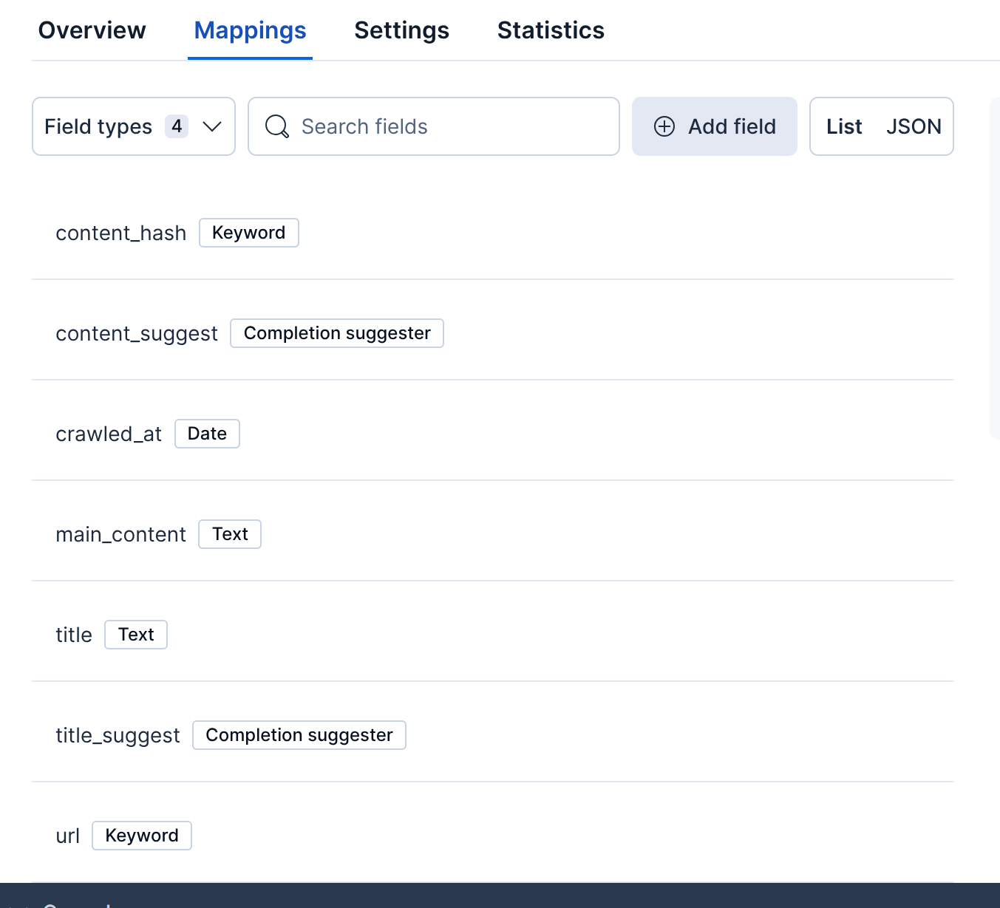 4. 前端调用示例
在前端输入框输入时，调用 /api/suggest?q=xxx&field=title 获取联想结果，并展示在下拉列表中。
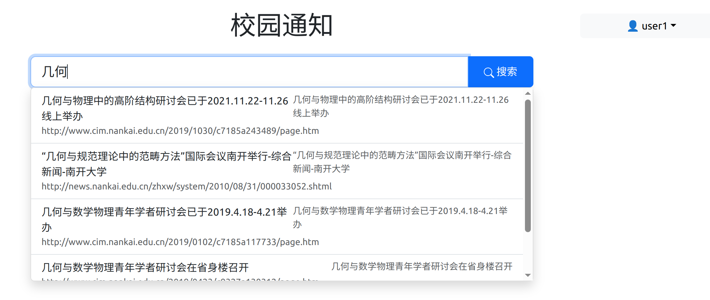

### 7 遇到的问题

- Flask-Login 需要用 session 存储用户登录状态，Flask 必须设置 app.secret_key（或 app.config['SECRET_KEY']），否则 session 不可用，登录时报 500 错。登陆成功
- ES 文档 id 不是单独的 content_hash，而是 content_hash + 下划线 + 时间戳
