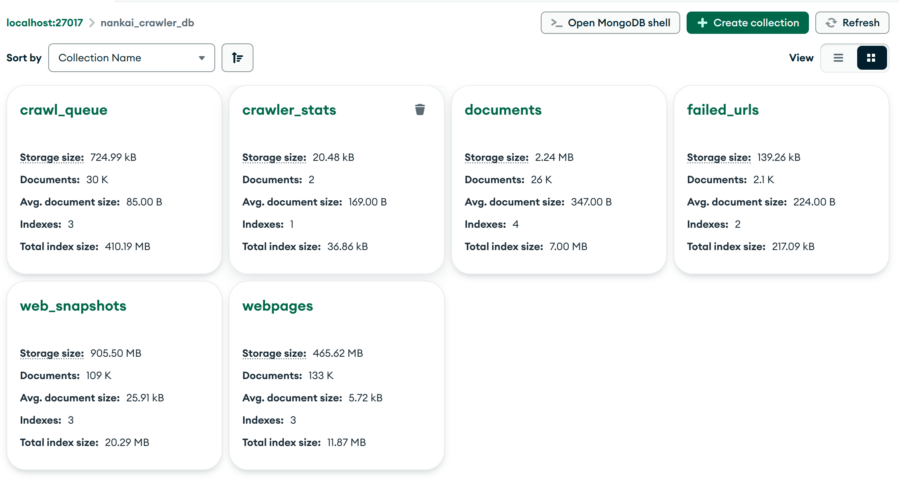

短语查询例子 不要找南开大学 和 南开 大学
文件查询 校历 通过文件名检索文件
登陆系统用户切换 个性化推荐

什么样的感觉呢 缝缝补补的爬虫代码

HW4 - NKU Web Search Engine 2. 具体实现
本次作业主要包含网页抓取、文本索引、查询服务、个性化查询五个步骤。
2.1 网页抓取
对南开校内资源进行抓取，依据自己主题而定。
抓取网页数量至少为 10 万，低于该数量将酌情扣分。

再次强调，请在校内抓取、礼貌抓取，遵循爬虫协议。
2.2 文本索引
对网页及其锚文本构建索引，可以设置多个索引域，比如：网页标题，URL，锚文本等。

2.2.1 对抓取的网页索引

```python
index_name = "webpages_index"
mapping = {
"mappings": {
   "properties": {
      "title": {"type": "text", "analyzer": "ik_max_word"},
      "main_content": {"type": "text", "analyzer": "ik_max_word"},
      "url": {"type": "keyword"},
      "crawled_at": {"type": "date"}
   }
}
}
```

2.2.2 对抓取的文档进行索引

```python

document_index = "documents_index"
mapping = {
   "mappings": {
      "properties": {
            "filename": {
               "type": "text",
               "analyzer": "ik_max_word"  # 支持中文文件名分词
            },
            "file_type": {"type": "keyword"},
            "url": {"type": "keyword"},
            "source_page": {"type": "keyword"},
            "crawled_at": {"type": "date"}
      }
   }
}


```

2.2.3 对保存的网络快照进行索引

```py
 mapping = {
     "mappings": {
         "properties": {
             "url": {"type": "keyword"},
             "content_hash": {"type": "keyword"},
             "snapshot_date": {"type": "date"},
             "content_text": {"type": "text", "analyzer": "ik_max_word"},
             "raw_html": {"type": "text", "index": False},
             "status_code": {"type": "integer"},
             "response_headers": {"type": "object", "enabled": False}
         }
     }
 }

```

2.4 查询服务
基于向量空间模型，结合链接分析结果对查询结果进行排序。为用户提供站内查询、文档查询、短语查询、通配查询、查询日志、网页快照等共计六种高级搜索功能。
2.4.1 站内查询
基本的查询操作，送分项。

```python
   @app.post("/search")
   async def search_articles(req: SearchRequest):
      try:
         # 构建ES查询
         search_body = {
               "query": {
                  "multi_match": {
                     "query": req.query,
                     "fields": ["title^3", "content"],  # 搜索标题和内容，标题权重更高
                     "type": "best_fields"
                  }
               },
               "highlight": {
                  "pre_tags": ["<em class='highlight'>"],  # 高亮前缀
                  "post_tags": ["</em>"],                 # 高亮后缀
                  "fields": {
                     "title": {},  # 高亮标题
                     "content": {}  # 高亮内容
                  }
               },
               "from": (req.page - 1) * req.size,  # 分页起始位置
               "size": req.size  # 每页大小
         }

         # 添加排序
         if req.sort:
               search_body["sort"] = [
                  {field: order}
                  for part in req.sort.split(",")
                  for field, order in [part.split(":")]
               ]

         # 执行搜索
         result = es.search(
               index=settings.ES_INDEX,  # Elasticsearch 索引
               body=search_body          # 查询条件
         )

         # 格式化结果
         return {
               "total": result["hits"]["total"]["value"],  # 总匹配数
               "items": [
                  {
                     "id": hit["_id"],  # 文档 ID
                     "score": hit["_score"],  # 匹配得分
                     "title": hit["highlight"].get("title", [hit["_source"]["title"]])[0],  # 高亮标题
                     "content": hit["highlight"].get("content", [hit["_source"]["content"]])[0],  # 高亮内容
                     "url": hit["_source"]["url"],  # 原始 URL
                     "publish_date": hit["_source"].get("publish_date")  # 发布时间
                  }
                  for hit in result["hits"]["hits"]
               ]
         }
      except Exception as e:
         raise HTTPException(
               status_code=500,
               detail=f"搜索失败: {str(e)}"
         )

```

查询截图


2.4.2 文档查询
一些网页可能会携带或其本身就是附件下载链接，支持对文档（doc/docx，pdf，xls/xlsx 等）的查询操作。

2.4.3 短语查询
也是基本的查询操作，支持对多个 Term 的查询。注意，“南开 1 大学 2”和“南开 1 是一所综合性大学 2”的区别。

- match_phrase：

  //用于匹配短语，确保查询的词语按顺序出现在文档中。
  例如，查询 "南开大学" 时，只有包含完整短语 "南开大学" 的文档会被匹配，而不会匹配仅包含 "南开" 或 "大学" 的文档。//
  
  查询科学文化
  和科学 文化
  
  通过 Elasticsearch 的 multi*match 查询，类型设置为 phrase，实现了在多个字段中搜索精确的短语匹配。用户提供的短语会被分析器处理成词条序列，并在指定的字段中按顺序匹配。分页参数控制返回的结果数量和偏移，最终将匹配的文档信息返回给客户端
  2.4.4 通配查询
  用户可能并不知道自己要查什么，支持通配符（正则）查询操作。例如：*代表多个字符，？代表一个字符，“温\_”用于查询所有姓温的老师，“计？”用于查询如“计网”、“计算”等词。
  2.4.4.1 通配符转换逻辑

  - 通配符模式（wildcard）

    - 将用户输入的\_替换为\*（多字符通配符），？替换为?（单字符通配符）。
    - 示例："te_t" → "te\*t"，可匹配"test"、"text"等。

  - 正则模式（regex）

    - 将\_转为.\*（任意字符序列），？转为.（单个字符）。
    - 示例："file_202?" → "file.\*202."，匹配"file_2023"、"file123_2024"等。

      2.4.4.2 特殊查询实现

  - 后缀查询（suffix）

    - 通过正则表达式.\*{query}实现，匹配以指定字符串结尾的内容。
    - 示例：query="ing" → ".\*ing"，匹配"running"、"coding"。

  - 模糊查询（fuzzy）

        - 使用 fuzziness: "AUTO"自动计算允许的编辑距离（基于词长），支持拼写容错。
        - 示例：query="appl"可匹配"apple"（编辑距离 1）。

          2.4.5 查询日志
          参考百度的查询日志（历史），能够知道用户之前查了什么。

          状态框里实现

          2.4.6 网页快照
          网页快照是搜索引擎在收录网页时，对网页进行备份，存在自己的服务器缓存里，当用户在搜索引擎中点击链接时，搜索引擎将爬虫系统当时所抓取并保存的网页内容展现出来，称为网页快照。
          例如：2008 年 7 月 20 日打开一个 Google 的网页快照，而这张快照上显示是 Google 在 7 月 10 日搜索并存档的。这表示：2008 年 7 月 20 日，这个网页或许已被删除或更新，但是，2008 年 7 月 10 日，当 Google 对该网页复制存档的时候，该网页是确实存在的。
         1. 爬虫抓取网页时保存快照到 web_snapshots。

         2. 用户点击“查看快照”时，访问 /api/snapshot/view/<content_hash>。
         3. Flask 查询快照并渲染 snapshot.html，展示网页内容。

    2.5 个性化查询
    针对不同登录用户提供不同的内容排序。
    建议实现一个注册/登录系统，通过提供不同的用户信息实现内容排序算法的修正。

          用户登录后，后端根据其 profile（如兴趣、学院、角色等）调整 ES 查询的排序规则（如加权、boost、排序字段等）。
          2.5.1 用户表结构
          用户名（唯一）
          密码（建议加密存储）
          其他信息（如邮箱

          - 后端：

            - 用户模型：

            ```py
                     from flask_login import UserMixin
            from werkzeug.security import generate_password_hash, check_password_hash
            from pymongo import MongoClient

            client = MongoClient("mongodb://localhost:27017")
            db = client["nankai_crawler_db"]
            users_collection = db["users"]

            class User(UserMixin):
                def __init__(self, username, password_hash):
                    self.id = username
                    self.password_hash = password_hash

                @staticmethod
                def get(username):
                    user_doc = users_collection.find_one({"username": username})
                    if user_doc:
                        return User(user_doc["username"], user_doc["password_hash"])
                    return None

                def check_password(self, password):
                    return check_password_hash(self.password_hash, password)

            ```

            - 登陆相关蓝图

            ```py
                     from flask import Blueprint, request, jsonify
            from flask_login import login_user, logout_user, login_required, current_user
            from werkzeug.security import generate_password_hash
            from ..models.user import User, users_collection

            auth_bp = Blueprint("auth", __name__)

            @auth_bp.route("/register", methods=["POST"])
            def register():
                data = request.get_json()
                username = data["username"]
                password = data["password"]
                if users_collection.find_one({"username": username}):
                    return jsonify({"error": "用户名已存在"}), 400
                password_hash = generate_password_hash(password)
                users_collection.insert_one({"username": username, "password_hash": password_hash})
                return jsonify({"msg": "注册成功"})

            @auth_bp.route("/login", methods=["POST"])
            def login():
                data = request.get_json()
                username = data["username"]
                password = data["password"]
                user = User.get(username)
                if user and user.check_password(password):
                    login_user(user)
                    return jsonify({"msg": "登录成功", "username": username})
                return jsonify({"error": "用户名或密码错误"}), 401

            @auth_bp.route("/logout", methods=["POST"])
            @login_required
            def logout():
                logout_user()
                return jsonify({"msg": "已退出登录"})

            @auth_bp.route("/whoami", methods=["GET"])
            def whoami():
                if current_user.is_authenticated:
                    return jsonify({"username": current_user.id})
                else:
                    return jsonify({"username": None})


            ```

          * 主程序注册

          ```py
                from flask_login import LoginManager
          from .routers.auth import auth_bp

          login_manager = LoginManager()
          login_manager.init_app(app)

          from .models.user import User

          @login_manager.user_loader
          def load_user(username):
              return User.get(username)

          app.register_blueprint(auth_bp, url_prefix="/api/auth")


          ```

          2.6 Web 界面
          本次作业不强调界面美观度，以功能为主。
          因此，可以 Terminal，可以 Web Page，二者不会存在得分区别。
          2.7 个性化推荐
          个性化推荐存在两类，一个是搜索上的联想关联，一个是内容分析后的推荐。任选其中一种实现即可。

sudo systemctl start mongod
elastic-start-local/start.sh
python -m search_service.app.main

- 错误
  Flask-Login 需要用 session 存储用户登录状态，Flask 必须设置 app.secret_key（或 app.config['SECRET_KEY']），否则 session 不可用，登录时报 500 错。登陆成功
